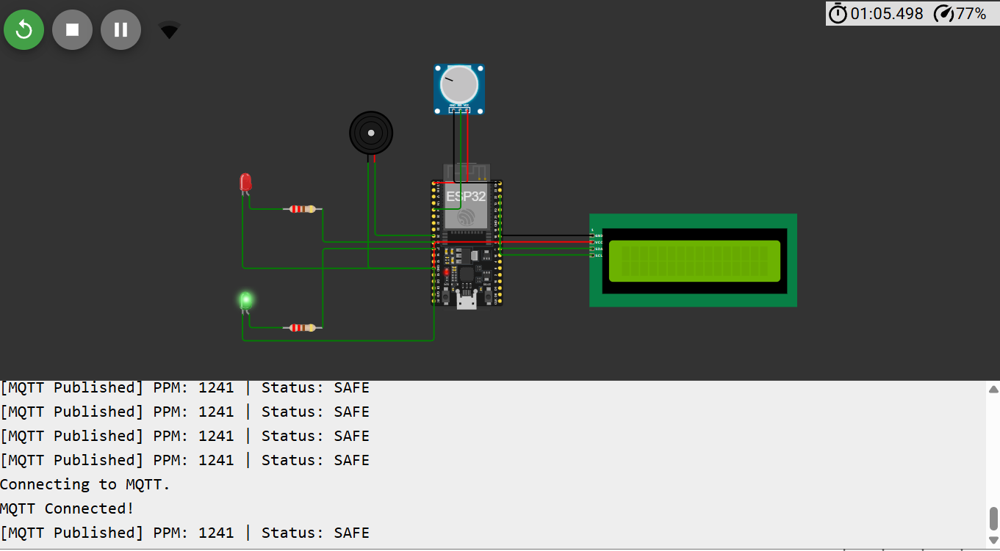

# 🚨 FPGA-Enabled Gas Leakage Monitoring System 🔥🛡️

## 📖 Overview

The **FPGA-Enabled Gas Leakage Monitoring System** is a real-time safety monitoring solution designed to detect hazardous gas leaks and provide immediate alerts to prevent accidents in industrial 🏭, commercial 🏢, and residential 🏠 environments.

The system leverages the power of an **FPGA (Field Programmable Gate Array)** for ultra-fast ⚡ signal processing, enabling rapid leak detection and response. By integrating gas sensors with FPGA-based digital logic, the system continuously monitors gas concentration levels and activates warning mechanisms whenever dangerous thresholds are exceeded.

---

## 🎯 Problem Statement

Gas leakage remains one of the most dangerous safety threats in homes and industries.

### ⚠️ Major Risks

🔥 Fire Hazards

💥 Explosions

☠️ Toxic Gas Exposure

🏭 Industrial Accidents

🌍 Environmental Damage

💰 Economic Losses and Downtime

Traditional monitoring systems may suffer from limited processing capabilities and delayed responses. This project demonstrates how FPGA technology can enhance safety through high-speed parallel processing and reliable real-time monitoring.

---

## 🚀 Project Objectives

✅ Detect gas leaks in real time

✅ Continuously monitor gas concentration levels

✅ Generate instant alerts during emergencies

✅ Improve system reliability using FPGA architecture

✅ Demonstrate FPGA applications in safety-critical systems

✅ Reduce response time during hazardous events

---

## ✨ Key Features

🚨 Real-Time Gas Leak Detection

⚡ FPGA-Based High-Speed Processing

🔄 Parallel Data Processing

💡 LED Warning Indicators

🔊 Buzzer-Based Emergency Alert System

🎯 Configurable Safety Thresholds

📊 Continuous Monitoring

🛡️ Reliable Safety Mechanism

📈 Scalable Multi-Sensor Architecture

🔋 Low Power Consumption

---
## Circuit Setup



## 🏗️ System Architecture

```text
Gas Sensor
     ↓
Signal Conditioning Circuit
     ↓
FPGA Processing Unit
     ↓
Threshold Comparison Logic
     ↓
Alert Controller
     ↓
LED Indicators + Buzzer Alarm
```

---

## 🧩 Hardware Components

| 🔧 Component              | 📌 Purpose                  |
| ------------------------- | --------------------------- |
| FPGA Development Board    | Core processing unit        |
| MQ-Series Gas Sensor      | Gas concentration detection |
| LEDs                      | Visual alerts               |
| Buzzer                    | Audible alarm               |
| Power Supply              | System operation            |
| Display Module (Optional) | Live monitoring             |
| Connecting Wires          | Hardware interfacing        |

---

## ⚙️ Working Principle

### Step 1️⃣

The gas sensor continuously detects gas concentration in the surrounding environment.

### Step 2️⃣

Sensor outputs are transmitted to the FPGA processing unit.

### Step 3️⃣

The FPGA analyzes incoming data using high-speed digital logic.

### Step 4️⃣

Measured values are compared against predefined safety thresholds.

### Step 5️⃣

If gas concentration exceeds safe limits:

🚨 Alarm is activated

💡 LEDs start blinking

🔊 Buzzer generates warning sound

⚠️ Emergency status is triggered

### Step 6️⃣

The system continues monitoring until gas levels return to safe conditions.

---

## 🖥️ FPGA Design Modules

### 📡 Sensor Interface Module

* Acquires sensor data
* Converts signals into FPGA-readable format
* Maintains continuous data flow

### 🎯 Threshold Comparator Module

* Compares measured gas levels with safety thresholds
* Determines leak status

### 🚨 Alert Controller Module

* Controls LED indicators
* Activates buzzer alerts
* Generates emergency signals

### 📊 Monitoring Module

* Tracks system health
* Ensures reliable operation
* Maintains continuous surveillance

---

## 🛠️ Technologies Used

💻 FPGA Development Board

⚙️ Verilog HDL

🔢 Digital Logic Design

📡 Sensor Interfacing

🔌 Embedded Systems

🖥️ Hardware Description Languages

🛡️ Safety Monitoring Systems

---

## 🌍 Applications

### 🏭 Industrial Safety

Monitoring chemical plants, manufacturing facilities, and gas pipelines.

### 🏢 Smart Buildings

Leak detection in offices and commercial infrastructures.

### 🏠 Residential Safety

Preventing domestic gas-related accidents.

### 🧪 Research Laboratories

Monitoring hazardous gases in scientific environments.

### ⛽ Oil & Gas Industry

Ensuring safe storage and transportation operations.

### 🚇 Underground Facilities

Monitoring gas accumulation in tunnels and mines.

---

## 🎖️ Advantages of FPGA-Based Implementation

⚡ Ultra-Fast Processing

🔄 True Parallel Execution

🛡️ High Reliability

📉 Low Response Latency

🔧 Reconfigurable Architecture

📈 Scalable Design

🔋 Energy Efficient

💪 Robust Performance

🏆 Suitable for Safety-Critical Applications

---

## 📊 Project Results

### ✅ Successfully Achieved

🚨 Real-time gas leak detection

⚡ Fast FPGA-based processing

🔊 Immediate alarm activation

💡 Reliable warning indication

📈 Continuous environmental monitoring

🛡️ Enhanced operational safety

🏆 Validation of FPGA effectiveness in safety applications

---

## 🔮 Future Enhancements

🌐 IoT Integration

☁️ Cloud-Based Data Storage

📱 Mobile Application Monitoring

📩 SMS & Email Notifications

🤖 AI-Based Leak Prediction

📊 Real-Time Analytics Dashboard

📡 Wireless Sensor Network Integration

🧠 Machine Learning for Predictive Maintenance

🌍 Smart City Safety Infrastructure

🚀 Industry 4.0 Compatibility

---

## 🎓 Learning Outcomes

Through this project, the following concepts were explored:

💻 FPGA Programming

⚙️ Verilog HDL Development

🔢 Digital System Design

📡 Sensor Interfacing

🖥️ Embedded Systems

🚨 Safety-Critical Engineering

📊 Real-Time Monitoring Systems

🔧 Hardware Optimization

🏗️ System Architecture Design

---

## 📌 Project Status

### ✅ COMPLETED

🏆 Successfully designed and implemented.

🚀 Demonstrates the power of FPGA technology for real-time safety monitoring applications.

🛡️ Provides a scalable foundation for future smart industrial safety systems.

---

## 👨‍💻 Author

### Yash Shashwat Bhengraj

🎓 B.Tech – Electronics & Communication Engineering (ECE)

🏛️ Birla Institute of Technology (BIT), Mesra

💻 Passionate about FPGA Design, Embedded Systems, Artificial Intelligence, Space Technology, and Innovative Engineering Solutions.

---

## ⭐ If you found this project interesting, consider giving it a Star on GitHub!

